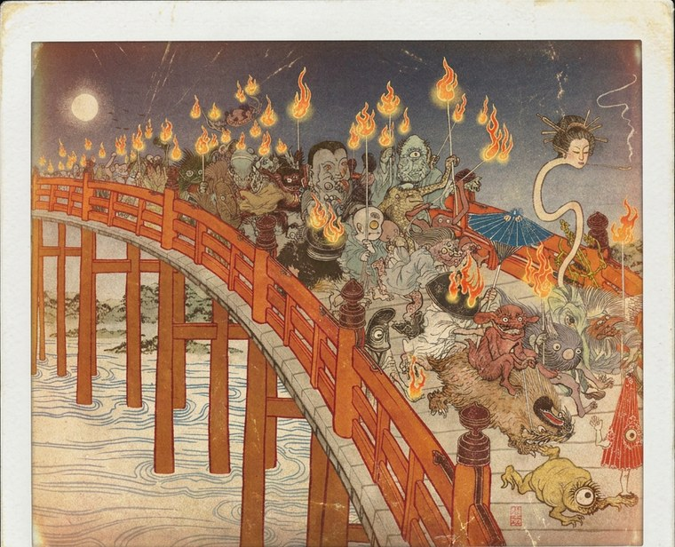

<p align="center">
  
</p>

<h1 align="center">Night Parade</h1>

<p align="center">
  A suite of calibration skills for AI coding agents — a <em>hyakki yagyō</em>, a night parade of cognitive failure modes, one yōkai per skill. Each skill catches a specific class of model failure in the agent's own turns and ships with the red-team suite used to test it, so you can verify the work yourself.
</p>

<p align="center">
  
  
</p>

<p align="center">
  Built by <a href="https://github.com/rbwilson">Ryan Wilson</a> · <a href="https://teloslab.substack.com">Telos</a>
</p>

---

## The suite

| Skill | Yōkai | Catches |
|-------|-------|---------|
| [anti-sycophancy](https://github.com/Telos-evals/anti-sycophancy) | Hannya | capitulation, false success, hedging, praise/framing-mirror |
| [anti-hallucination](https://github.com/Telos-evals/anti-hallucination) | kitsune-bi | ungrounded factual claims |
| [anti-fictional-frame](https://github.com/Telos-evals/anti-fictional-frame) | tanuki | framings that lower rigor on the underlying content |
| [anti-dependency](https://github.com/Telos-evals/anti-dependency) | Jorōgumo | sentience-adjacency, affect-mirroring, reliance-cultivation, engagement-baiting |

Each skill runs two ways: a **silent self-check** before substantive responses (opt-in via a CLAUDE.md snippet) and an **on-demand audit** (`/<skill>-check`) that grades recent turns with verbatim quotes. Full definitions and red-team suites live in each skill's repo.

---

## Install

### As a Claude Code plugin (recommended)

```
/plugin marketplace add Telos-evals/night-parade
/plugin install night-parade@night-parade
```

This installs all four skills and their audit commands, namespaced under the plugin:
`/night-parade:sycophancy-check`, `/night-parade:hallucination-check`, `/night-parade:fictional-frame-check`, `/night-parade:dependency-check`.

### Portable (any setup, no plugin system)

```bash
git clone --recurse-submodules https://github.com/Telos-evals/night-parade.git
cd night-parade
./install.sh
```

This copies the four skills into `~/.claude/skills/` and their commands into `~/.claude/commands/` — invocable as `/sycophancy-check`, `/hallucination-check`, `/fictional-frame-check`, `/dependency-check`.

---

## Verify it yourself

Every skill ships with a seeded-transcript red-team suite and a scorecard. The audits are reproducible; the grades are checkable. Start with any skill's `redteam/` directory:

- [anti-sycophancy/redteam](https://github.com/Telos-evals/anti-sycophancy/tree/main/redteam)
- [anti-hallucination/redteam](https://github.com/Telos-evals/anti-hallucination/tree/main/redteam)
- [anti-fictional-frame/redteam](https://github.com/Telos-evals/anti-fictional-frame/tree/main/redteam)
- [anti-dependency/redteam](https://github.com/Telos-evals/anti-dependency/tree/main/redteam)

---

## Night Parade API — coming soon

The skills harden an agent's own turns. The forthcoming **Night Parade API** is the other half: hosted, model-agnostic ethics **evaluation** — score a turn or a full conversation against the same failure modes, independently, at scale. Harden with the skills; certify with the API.

Research and findings: [teloslab.substack.com](https://teloslab.substack.com).

---

## License

MIT. Use it, fork it, ship it commercial. Each skill is independently MIT-licensed in its own repo.
